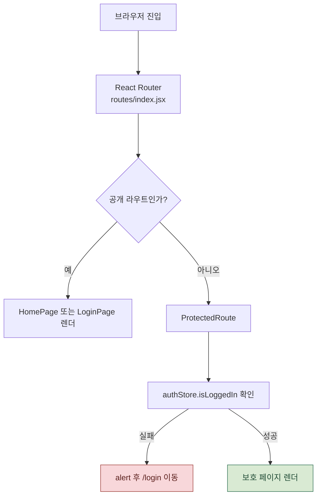
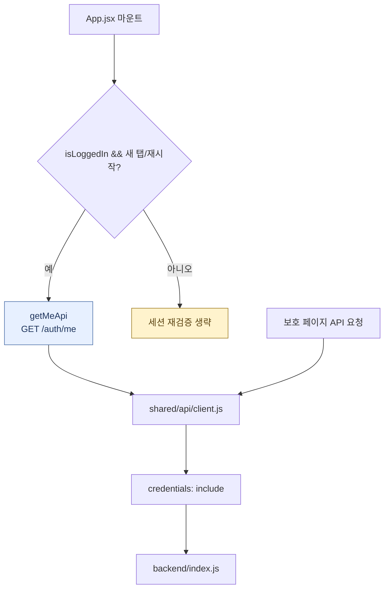
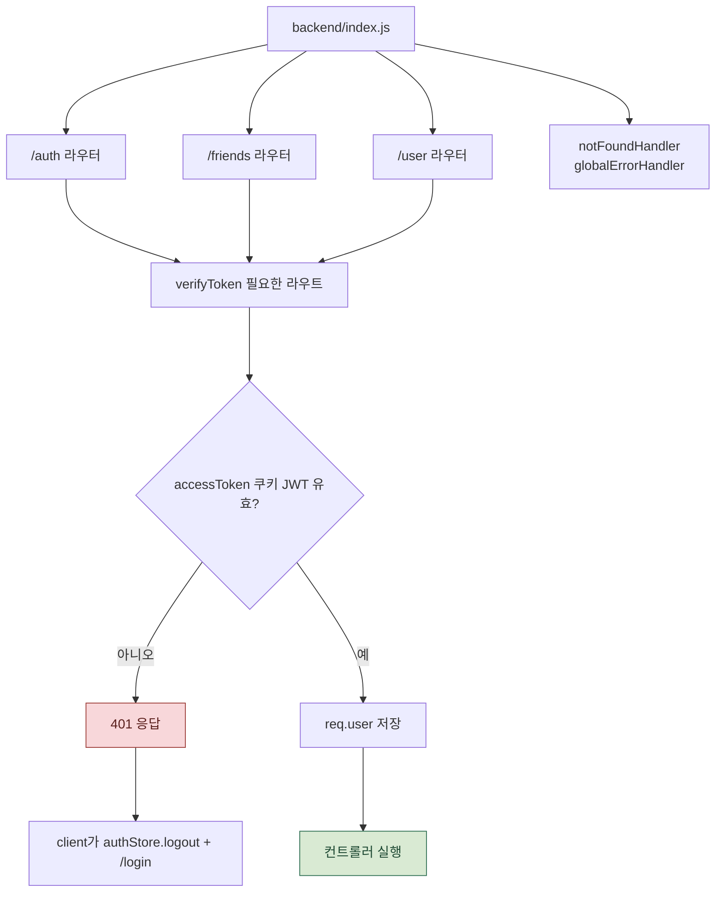
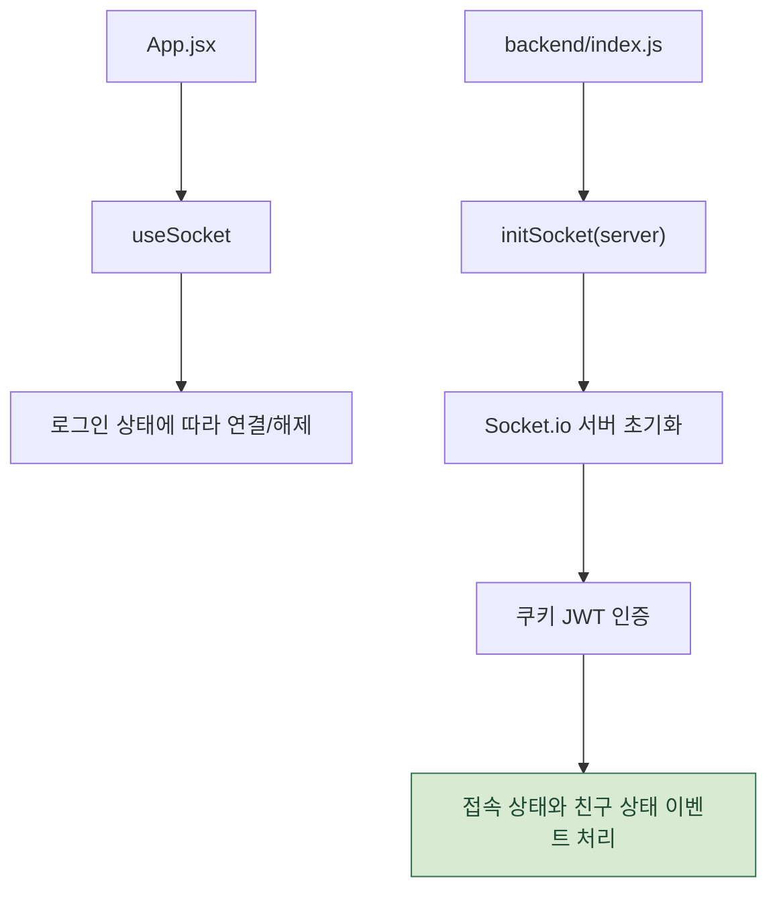

# 공통 인프라 흐름

프론트 라우팅, API 클라이언트, 백엔드 라우터 등록, 인증 미들웨어, 전역 에러 처리, 소켓 초기화가 앱 전체 흐름의 기반입니다.

한 화면에 모든 공통 인프라를 넣으면 Mermaid가 축소되어 작게 보이므로, 진입/라우팅, API/서버, 인증/소켓 흐름으로 나누었습니다.

관련 파일:

- `frontend/src/app/routes/index.jsx`
- `frontend/src/app/App.jsx`
- `frontend/src/shared/ui/ProtectedRoute.jsx`
- `frontend/src/shared/api/client.js`
- `backend/index.js`
- `backend/middleware/auth.middleware.js`
- `backend/middleware/errorHandler.js`
- `backend/utils/appError.js`
- `backend/socket/socket.js`

---

## 1. 브라우저 진입과 라우팅

보호 라우트의 첫 판단은 프론트 `authStore` 상태입니다.
서버 검증은 별도의 세션 재검증 또는 API 요청 시점에 수행됩니다.

---

## 2. 앱 시작과 API 공통 클라이언트

API 클라이언트는 쿠키 기반 인증을 위해 `credentials: include`를 공통으로 사용합니다.
401 응답은 클라이언트 공통 처리에서 로그아웃과 `/login` 이동으로 이어집니다.

---

## 3. 백엔드 라우터와 인증 미들웨어

라우터는 `backend/index.js`에서 등록되고, 인증이 필요한 라우트는 `verifyToken`을 거쳐 컨트롤러로 들어갑니다.

---

## 4. 소켓 초기화

소켓은 REST 라우터와 별도로 서버에 붙지만, 인증 기준은 쿠키의 JWT로 맞춰져 있습니다.

---

## 실제 코드에서 주의할 점 3가지

1. **프론트 인증 판단은 우선 `authStore` 기반입니다.** 보호 라우트는 서버 호출 없이 `isLoggedIn`만 보고 막습니다.
2. **서버 쿠키 검증은 `App.jsx`의 `getMeApi`와 백엔드 `verifyToken`에서 이뤄집니다.** 새 탭/재시작 케이스에서 localStorage 상태를 정리하는 용도입니다.
3. **API 401은 `shared/api/client.js`에서 공통 처리합니다.** `/login`이 아닌 화면에서는 자동 로그아웃 후 로그인 페이지로 보냅니다.

---

## 단계별 코드 위치

| 단계 | 파일:라인 | 내용 |
| --- | --- | --- |
| 라우트 트리 | `routes/index.jsx` | 공개 라우트와 `ProtectedRoute` 하위 보호 라우트 정의 |
| 앱 시작 처리 | `App.jsx` | 세션 재검증, `useSocket` 실행 |
| 보호 라우트 | `ProtectedRoute.jsx` | 로그인 상태 확인, 실패 시 `/login` |
| API 공통 처리 | `client.js` | 쿠키 포함 요청, 401 자동 로그아웃 |
| 서버 진입 | `backend/index.js` | 미들웨어, 라우터, 소켓, DB sync 등록 |
| 인증 미들웨어 | `auth.middleware.js` | 쿠키 JWT 검증 후 `req.user` 저장 |
| 에러 처리 | `errorHandler.js`, `appError.js` | 404/전역 에러 응답 포맷 통일 |
