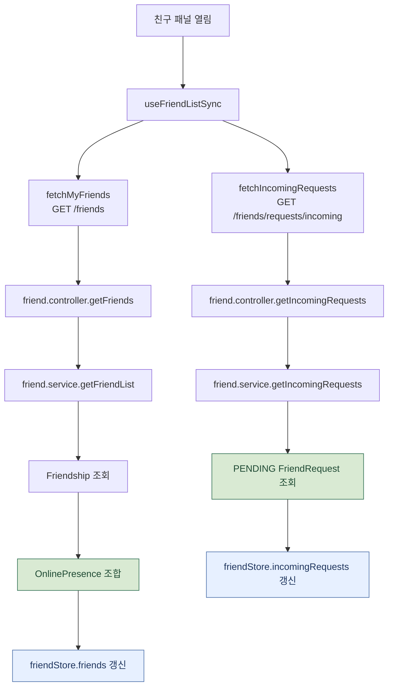
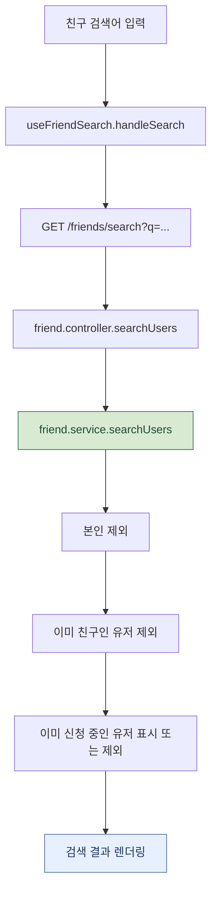
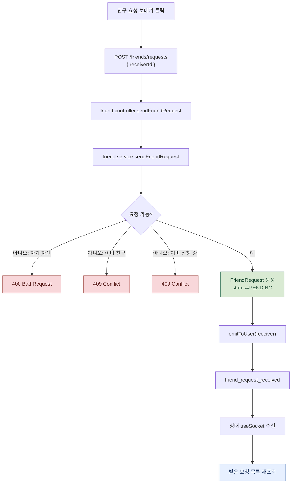
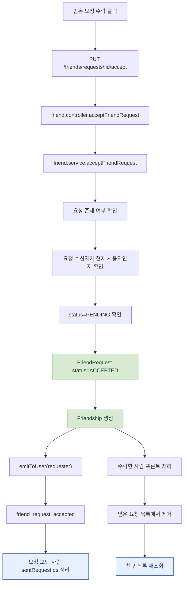
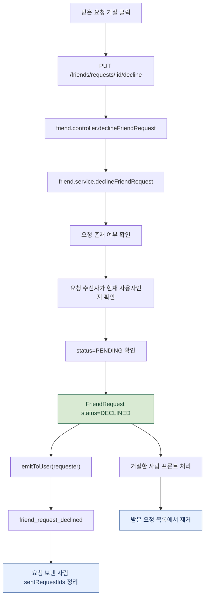
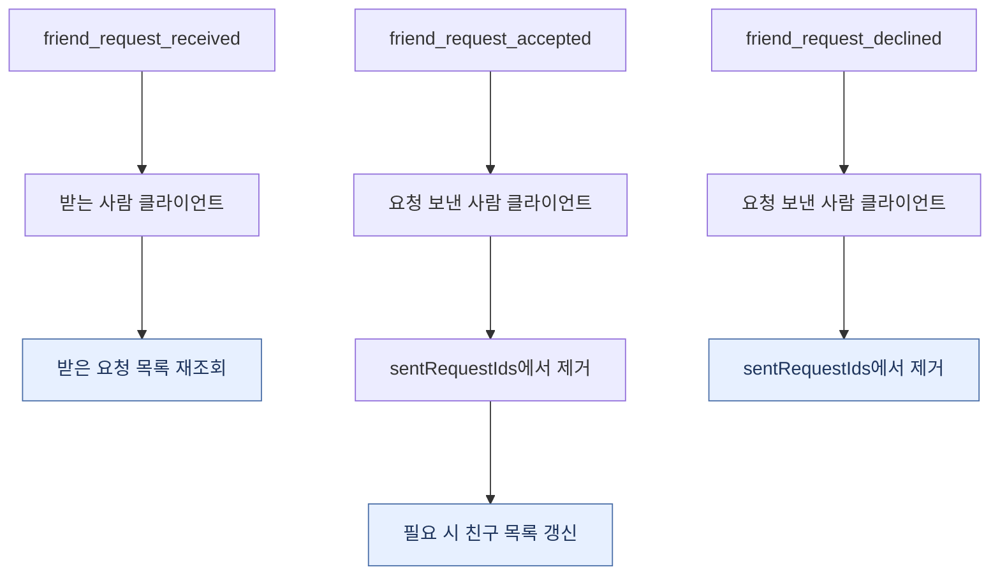

# 친구 처리 흐름

친구 목록 조회, 받은 요청 조회, 검색, 요청 전송, 수락, 거절 흐름입니다.
REST 처리 후 일부 결과는 Socket.io 이벤트로 상대에게 즉시 전달됩니다.

기존처럼 하나의 큰 흐름도에 모든 분기를 넣으면 문서 뷰어가 전체 그래프를 한 화면에 맞추면서 너무 작게 보입니다.
아래 문서는 같은 흐름을 단계별 Mermaid 블록으로 나누어, 문서 길이는 조금 길어져도 각 흐름도가 크게 보이도록 구성했습니다.

관련 파일:

- `frontend/src/domains/lobby/hooks/useFriendListSync.js`
- `frontend/src/domains/lobby/hooks/useFriendSearch.js`
- `frontend/src/domains/lobby/store/friendStore.js`
- `frontend/src/domains/lobby/api/friend.js`
- `backend/routes/friend.routes.js`
- `backend/controller/friend.controller.js`
- `backend/service/friend.service.js`
- `backend/repositories/friend.repositories.js`
- `backend/socket/socket.js`

---

## 1. 친구 패널 열림: 목록과 받은 요청 동기화

핵심은 친구 관계와 접속 상태가 분리되어 있다는 점입니다.
친구 목록은 `Friendship`을 기준으로 가져오고, 온라인 여부는 `OnlinePresence`와 조합해서 프론트에 내려갑니다.

---

## 2. 친구 검색

`useFriendSearch`는 검색 결과와 함께 `sentRequestIds` 상태를 관리합니다.
이미 요청한 사용자는 버튼 상태를 바꾸거나 중복 요청을 막는 데 이 값이 쓰입니다.

---

## 3. 친구 요청 보내기

요청 생성에 성공하면 REST 응답만 끝나는 것이 아니라, 받는 사람에게 Socket.io 이벤트가 갑니다.
상대 클라이언트는 `friend_request_received` 이벤트를 받고 받은 요청 목록을 다시 가져옵니다.

---

## 4. 받은 요청 수락

수락한 쪽 프론트는 받은 요청을 낙관적으로 목록에서 제거합니다.
그리고 새 친구가 추가되었으므로 친구 목록도 다시 가져옵니다.

---

## 5. 받은 요청 거절

거절은 친구 관계를 만들지 않습니다.
대신 요청 상태만 `DECLINED`로 바꾸고, 요청을 보낸 사람에게 소켓 이벤트를 보내 신청 중 상태를 정리하게 합니다.

---

## 6. Socket.io 이벤트 기준으로 다시 보기

소켓 이벤트는 DB 처리의 원천이 아니라, REST 처리 결과를 상대 클라이언트에 즉시 알려주는 역할입니다.
실제 데이터 정합성은 REST API와 서비스 계층의 검증 및 DB 업데이트가 책임집니다.

---

## 실제 코드에서 주의할 점 3가지

1. **받은 요청 수락/거절 후 프론트는 낙관적으로 목록에서 제거합니다.** 수락 시에는 친구 목록도 다시 가져옵니다.
2. **요청을 보낸 사람에게는 소켓 이벤트가 갑니다.** `friend_request_accepted/declined`로 `sentRequestIds`를 정리합니다.
3. **친구 목록의 online 상태는 `OnlinePresence`와 조합합니다.** 친구 관계 자체와 접속 상태 저장소가 분리되어 있습니다.

---

## 단계별 코드 위치

| 단계 | 파일:라인 | 내용 |
| --- | --- | --- |
| 친구 목록 동기화 | `useFriendListSync.js:19-76` | 패널 열림, 새로고침, 수락/거절 핸들러 |
| 친구 검색 | `useFriendSearch.js:12-61` | 검색, 요청 전송, sent/resolved 상태 |
| 친구 store | `friendStore.js` | friends/incomingRequests/sentRequestIds 관리 |
| 프론트 API | `friend.js` | `/friends` 계열 API 래퍼 |
| 라우트 | `friend.routes.js` | 모든 친구 API에 `verifyToken` 적용 |
| 컨트롤러 | `friend.controller.js` | REST 응답 + `emitToUser` 호출 |
| 서비스 | `friend.service.js` | 친구/요청 검증과 DB 처리 |
