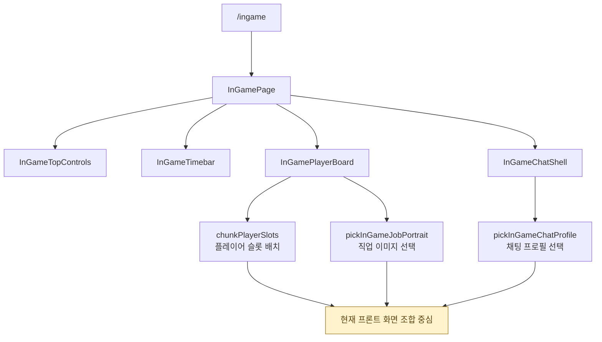
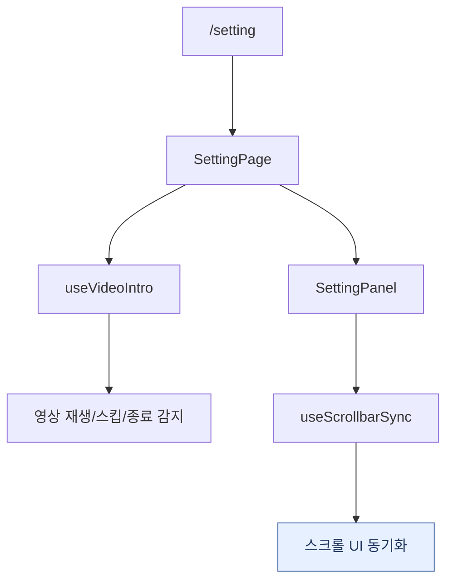
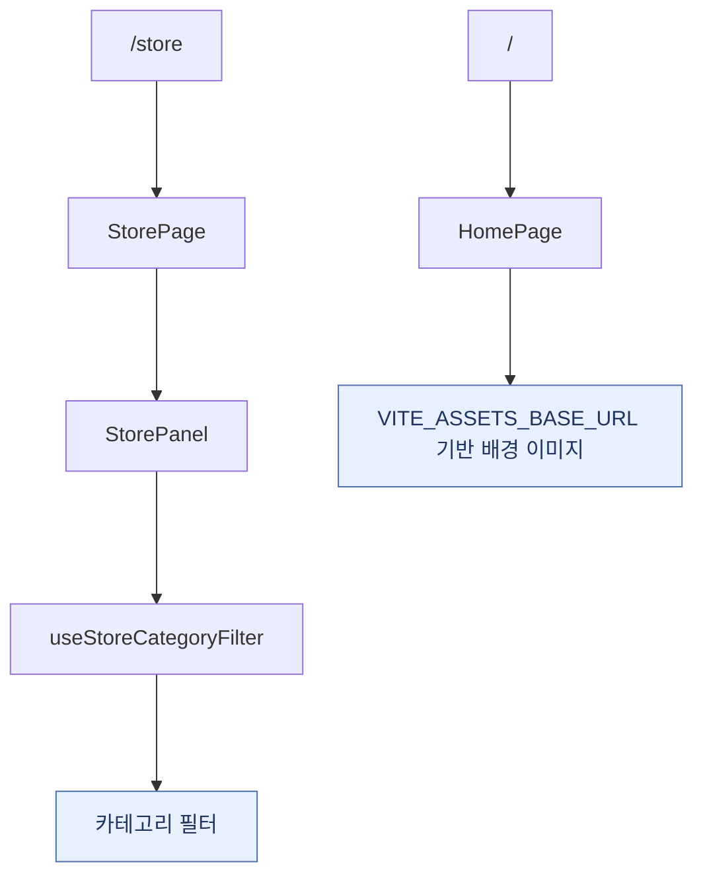
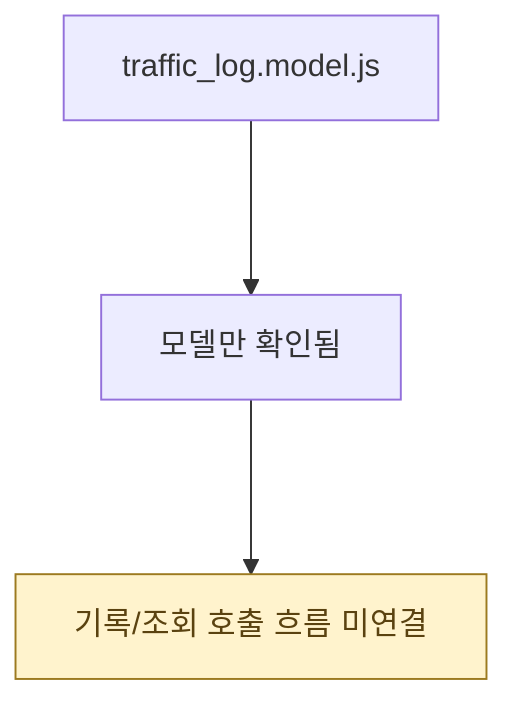

# 인게임 / 기타 페이지 흐름

인게임, 설정, 상점, 홈 화면은 현재 프론트 화면 조합과 로컬 상태 중심입니다. 백엔드 게임 진행 API나 소켓 이벤트 연동은 확인되지 않습니다.

기능이 서로 독립적인 편이라, 크게 보이도록 페이지 그룹별 흐름도로 나누었습니다.

관련 파일:

- `frontend/src/domains/game/ingame/pages/InGamePage.jsx`
- `frontend/src/domains/game/ingame/utils/pickInGameChatProfile.js`
- `frontend/src/domains/game/ingame/utils/pickInGameJobPortrait.js`
- `frontend/src/domains/game/shared/utils/chunkPlayerSlots.js`
- `frontend/src/domains/settings/pages/SettingPage.jsx`
- `frontend/src/domains/settings/hooks/useVideoIntro.js`
- `frontend/src/domains/settings/hooks/useScrollbarSync.js`
- `frontend/src/domains/store/pages/StorePage.jsx`
- `frontend/src/domains/store/hooks/useStoreCategoryFilter.js`
- `frontend/src/pages/HomePage.jsx`
- `backend/models/system/traffic_log.model.js`

---

## 1. 인게임 화면 조합

현재 인게임은 화면 조합과 표시용 유틸 중심입니다.
실제 게임 진행 상태, 타이머, 서버 채팅 이벤트와 연결된 흐름은 확인되지 않습니다.

---

## 2. 설정 화면

설정 화면은 영상 인트로와 스크롤 UI 동기화 등 프론트 로컬 인터랙션 중심입니다.

---

## 3. 상점과 홈

상점과 홈은 백엔드 API보다 화면 상태와 정적 리소스 사용에 가까운 흐름입니다.

---

## 4. 트래픽 로그 모델

`traffic_log`는 모델은 있지만 라우트, 서비스, 미들웨어에서 기록하거나 조회하는 호출 흐름은 찾지 못했습니다.

---

## 실제 코드에서 주의할 점 3가지

1. **인게임은 현재 레이아웃 조합 중심입니다.** 실제 게임 진행 상태, 타이머, 채팅 서버 이벤트와 연결된 흐름은 확인되지 않습니다.
2. **설정/상점은 프론트 로컬 인터랙션입니다.** 설정은 영상 인트로/스크롤 동기화, 상점은 카테고리 필터 중심입니다.
3. **`traffic_log`는 모델만 있습니다.** 라우트, 서비스, 미들웨어에서 기록하거나 조회하는 호출 흐름은 찾지 못했습니다.

---

## 단계별 코드 위치

| 단계 | 파일:라인 | 내용 |
| --- | --- | --- |
| 인게임 페이지 | `InGamePage.jsx` | 배경, 상단 컨트롤, 타임바, 보드, 채팅 조합 |
| 인게임 유틸 | `pickInGameChatProfile.js`, `pickInGameJobPortrait.js`, `chunkPlayerSlots.js` | 더미/표시용 데이터 선택과 배치 |
| 설정 페이지 | `SettingPage.jsx` | 영상 인트로 후 설정 패널 표시 |
| 설정 훅 | `useVideoIntro.js`, `useScrollbarSync.js` | 영상 제어, 스크롤 UI 동기화 |
| 상점 페이지 | `StorePage.jsx` | 상점 패널 표시 |
| 상점 훅 | `useStoreCategoryFilter.js` | 카테고리 필터 상태 |
| 홈 | `HomePage.jsx` | 정적 랜딩, R2 배경 URL 사용 |
| 트래픽 로그 모델 | `traffic_log.model.js` | 호출 흐름 미연결 |
