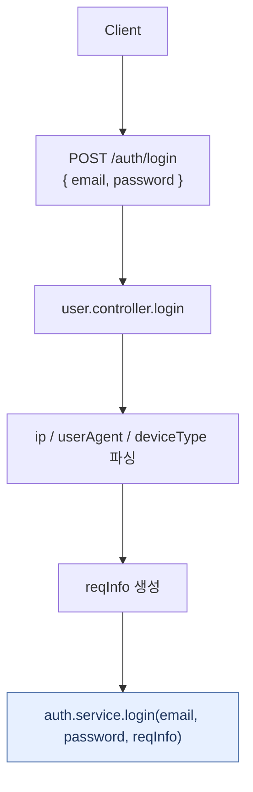
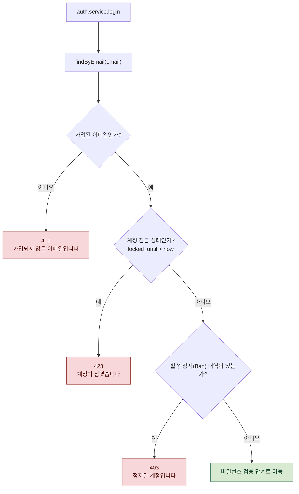
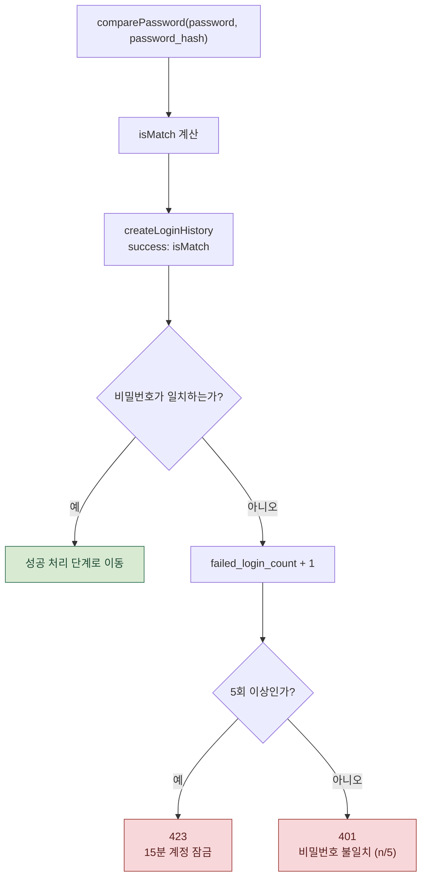
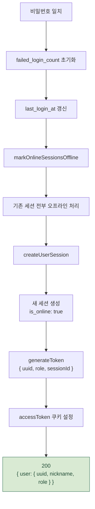

# 로그인 요청 처리 흐름

`POST /auth/login` 요청이 `user.controller.js` -> `auth.service.js` -> `user.repositories.js`를 거치는 실제 코드 흐름입니다.

로그인은 실패 분기와 성공 후 세션 처리가 함께 있어 한 장짜리 흐름도로 보면 작아집니다.
아래는 요청 파싱, 사전 검증, 비밀번호 실패 처리, 성공 처리로 나눈 버전입니다.

관련 파일:

- `backend/controller/user.controller.js`
- `backend/service/auth.service.js`
- `backend/repositories/user.repositories.js`

---

## 1. 요청 파싱과 서비스 진입

컨트롤러는 요청 정보를 모아 서비스에 넘기고, 실제 로그인 정책은 `auth.service.login`에서 처리합니다.

---

## 2. 이메일, 잠금, 정지 검증

정지(Ban) 체크는 비밀번호 확인보다 먼저 실행됩니다.
따라서 정지된 계정은 비밀번호 일치 여부와 무관하게 403으로 종료됩니다.

---

## 3. 비밀번호 검증과 실패 처리

로그인 이력은 성공/실패가 갈리기 전에 한 번 기록되고, `success` 필드에 비밀번호 대조 결과가 들어갑니다.

---

## 4. 성공 처리와 응답

로그인에 성공하면 기존 세션을 오프라인 처리한 뒤 새 세션을 생성합니다.
이 흐름이 단일 기기 로그인 정책의 핵심입니다.

> GitHub, VS Code(Markdown Preview Mermaid Support 확장), Obsidian 등에서 위 코드 블록이 다이어그램으로 바로 렌더링됩니다.

---

## 실제 코드에서 주의할 점 3가지

1. **정지(Ban) 체크는 비밀번호 확인보다 먼저, 결과와 무관하게** 실행됩니다. (`auth.service.js:67`) 비밀번호가 틀렸을 때만 안내되는 게 아닙니다.
2. **`createLoginHistory`는 성공/실패가 갈리기 전에 한 번만** 호출되고, `success` 필드에 비밀번호 대조 결과가 담겨 기록됩니다. (`auth.service.js:74`)
3. **세션 처리는 조건 분기가 아닙니다.** 로그인에 성공하면 이전 온라인/오프라인 상태와 무관하게 **항상** 기존 세션을 오프라인 처리한 뒤 새 세션을 생성합니다. (`auth.service.js:103-111`)

---

## 단계별 코드 위치

| 단계 | 파일:라인 | 내용 |
| --- | --- | --- |
| 요청 파싱 | `user.controller.js:33-40` | ip/userAgent/deviceType 추출 -> `authService.login` 호출 |
| 유저 조회 | `auth.service.js:58` | `findByEmail(email)` |
| 이메일 존재 확인 | `auth.service.js:59` | 없으면 401 |
| 잠금 확인 | `auth.service.js:63` | `locked_until > now`이면 423 |
| 정지 확인 | `auth.service.js:67` | `checkActiveBan`, 있으면 403 |
| 비밀번호 대조 | `auth.service.js:72` | `comparePassword` -> `isMatch` |
| 로그인 이력 기록 | `auth.service.js:74` | `createLoginHistory` (성공/실패 공통) |
| 실패 처리 | `auth.service.js:81-95` | 카운트 +1, 5회 이상이면 15분 잠금 |
| 성공 처리 | `auth.service.js:97-101` | 카운트 초기화, `last_login_at` 갱신 |
| 세션 갱신 | `auth.service.js:103-111` | 기존 세션 오프라인 처리 후 신규 세션 생성 |
| 토큰 발급 | `auth.service.js:113` | `generateToken({ uuid, role, sessionId })` |
| 쿠키 설정 | `user.controller.js:43-47` | `accessToken` 쿠키 (httpOnly / secure / SameSite=Lax) |
| 응답 | `user.controller.js:49-58` | `200 { user: { uuid, nickname, role } }` |
