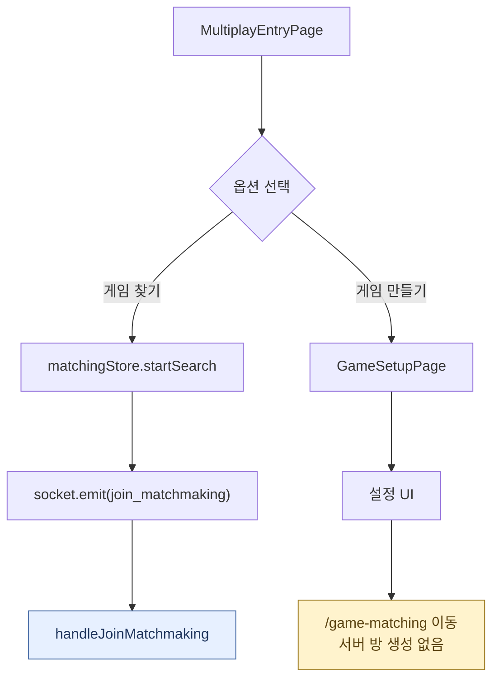
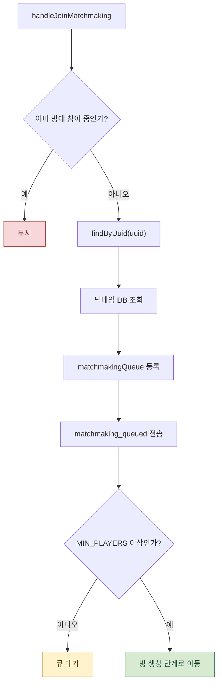
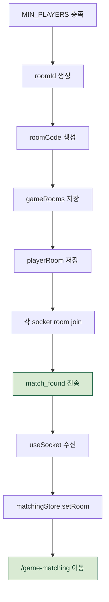
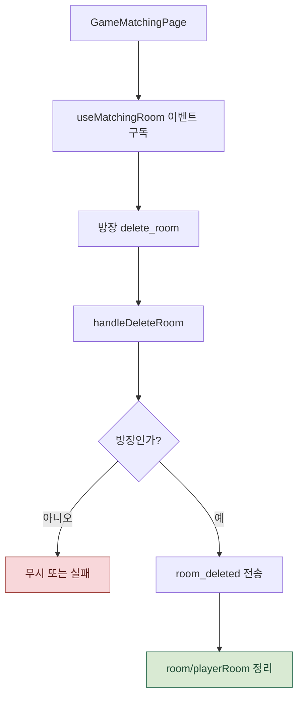
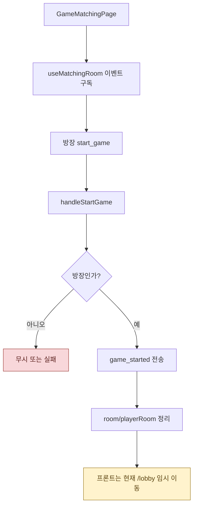
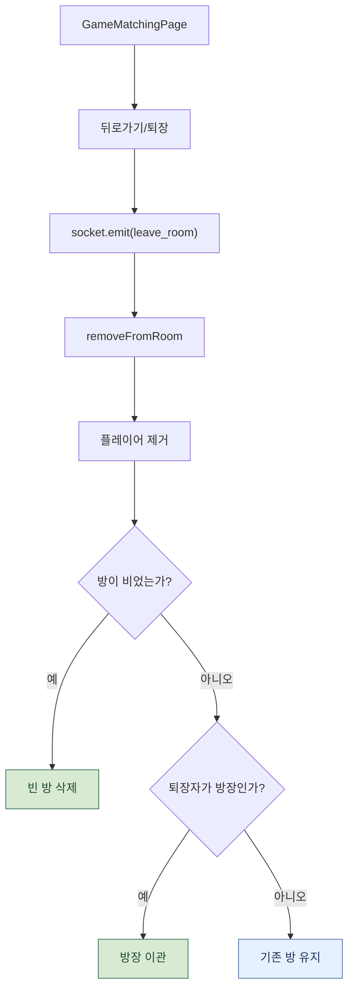
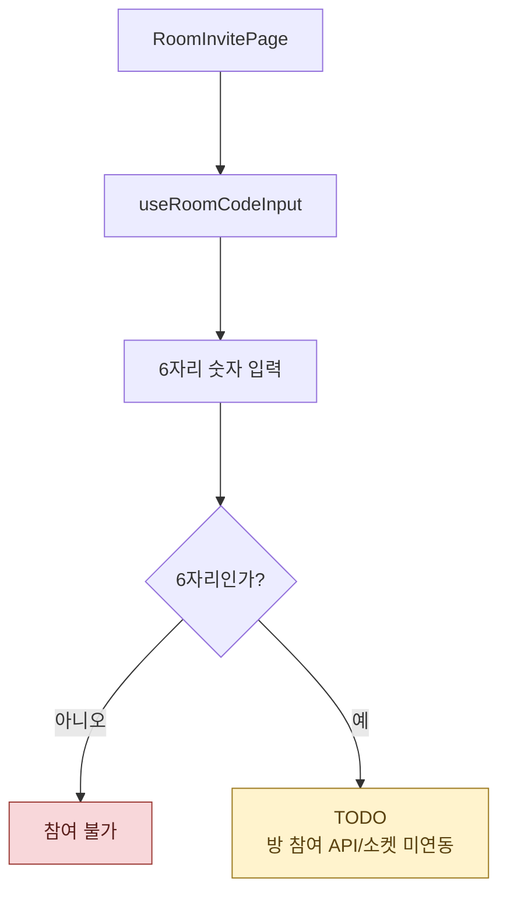

# 매칭 / 방 처리 흐름

게임 찾기는 Socket.io 기반 랜덤 매칭 큐와 인메모리 방 생성까지 연결되어 있습니다.
게임 만들기와 방 코드 참여는 현재 프론트 화면 중심의 부분 구현입니다.

매칭 문서는 분기가 가장 많아 한 장으로 보면 작게 보입니다.
아래는 게임 찾기, 방 생성, 매칭 화면 이벤트, 퇴장, 부분 구현 영역으로 나누었습니다.

관련 파일:

- `frontend/src/domains/game/mode/pages/MultiplayEntryPage.jsx`
- `frontend/src/domains/game/matching/store/matchingStore.js`
- `frontend/src/domains/game/matching/pages/GameMatchingPage.jsx`
- `frontend/src/domains/game/matching/hooks/useMatchingRoom.js`
- `frontend/src/domains/game/mode/pages/RoomInvitePage.jsx`
- `frontend/src/domains/game/mode/hooks/useRoomCodeInput.js`
- `frontend/src/domains/game/setup/pages/GameSetupPage.jsx`
- `backend/socket/matchmaking.js`
- `backend/utils/roomCode.js`

---

## 1. 멀티플레이 진입과 옵션 선택

현재 서버와 실제로 연결된 흐름은 `게임 찾기`입니다.
`게임 만들기`는 설정 UI 이후 매칭 화면으로 이동하지만 서버 방 생성은 없습니다.

---

## 2. 랜덤 매칭 큐 참가

매칭 큐는 서버 프로세스 메모리에 저장됩니다.
프로세스가 재시작되면 큐와 방 정보는 유지되지 않습니다.

---

## 3. 방 생성과 매칭 성공

랜덤 매칭 방은 `gameRooms`, `playerRoom` 같은 인메모리 Map으로 관리됩니다.

---

## 4. 매칭 화면에서 방 삭제

방 삭제는 방장만 허용됩니다.

---

## 5. 매칭 화면에서 게임 시작

게임 시작 후 실제 인게임 방으로 가지 않습니다.
`game_started` 수신 시 프론트는 현재 `/lobby`로 임시 이동합니다.

---

## 6. 뒤로가기와 방 퇴장

퇴장 시 방이 비면 삭제하고, 방장이 나갔지만 사람이 남아 있으면 방장을 이관합니다.

---

## 7. 방 코드 참여

방 코드 참여는 6자리 입력 UI만 있고, 실제 join API나 소켓 이벤트는 아직 연결되지 않았습니다.

---

## 실제 코드에서 주의할 점 3가지

1. **랜덤 매칭 방은 메모리에만 존재합니다.** `matchmakingQueue`, `gameRooms`, `playerRoom` 모두 서버 프로세스 메모리 Map입니다.
2. **게임 시작 후 실제 인게임 방으로 가지 않습니다.** `game_started` 수신 시 프론트는 현재 `/lobby`로 임시 이동합니다.
3. **방 코드 참여와 게임 만들기 방 생성은 아직 서버 연결이 없습니다.** 방 코드 입력 UI와 설정 UI는 있지만 join/create 이벤트나 API가 비어 있습니다.

---

## 단계별 코드 위치

| 단계 | 파일:라인 | 내용 |
| --- | --- | --- |
| 게임 찾기 선택 | `MultiplayEntryPage.jsx` | `startSearch`, `join_matchmaking` emit |
| 매칭 store | `matchingStore.js` | 큐/방 상태 저장 |
| 매칭 핸들러 등록 | `matchmaking.js:25-35` | 소켓 이벤트 등록 |
| 큐 참가/방 생성 | `matchmaking.js:43-74` | DB 닉네임 조회, 큐 등록, 방 생성 |
| 방 삭제 | `matchmaking.js:80-91` | 방장만 삭제 가능 |
| 게임 시작 | `matchmaking.js:93-104` | 방장만 시작 가능 |
| 방 퇴장 | `matchmaking.js:107-130` | 플레이어 제거, 방장 이관 |
| 방 코드 입력 | `RoomInvitePage.jsx`, `useRoomCodeInput.js` | 6자리 입력 UI, 참여 연동 TODO |
