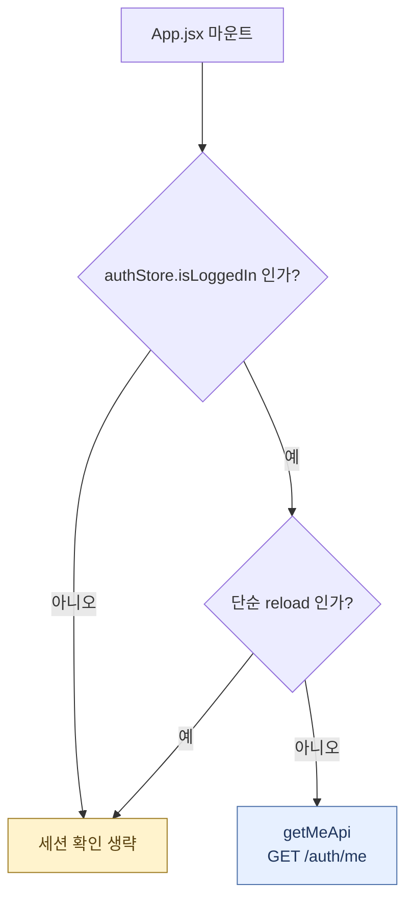
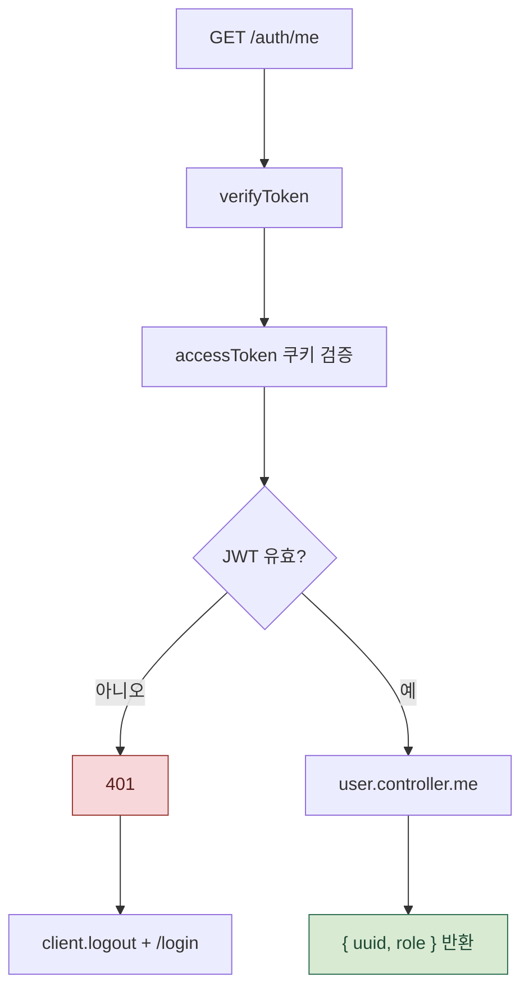
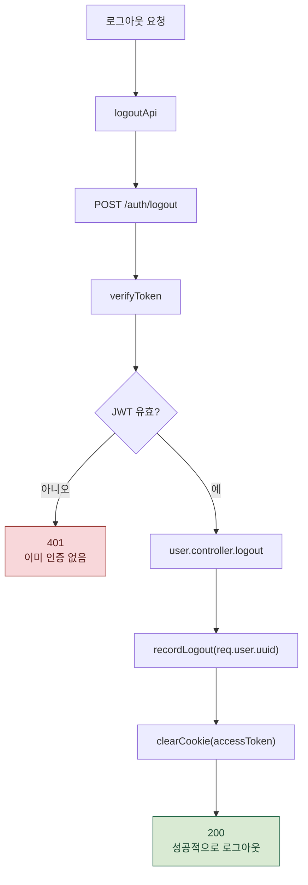

# 세션 확인 / 로그아웃 처리 흐름

세션 확인은 앱 시작 시 `GET /auth/me`로 쿠키 유효성을 검증하고, 로그아웃은 `POST /auth/logout`으로 세션 기록과 쿠키 제거를 처리합니다.

세션 확인과 로그아웃은 서로 다른 진입점이므로 각각 분리해 크게 보이도록 구성했습니다.

관련 파일:

- `frontend/src/app/App.jsx`
- `frontend/src/domains/auth/api/auth.js`
- `frontend/src/domains/auth/store/authStore.js`
- `frontend/src/shared/api/client.js`
- `backend/routes/auth.routes.js`
- `backend/middleware/auth.middleware.js`
- `backend/controller/user.controller.js`
- `backend/repositories/user.repositories.js`

---

## 1. 앱 시작 시 세션 확인 여부 결정

`sessionStorage`의 `RELOAD_FLAG`로 새 탭/재시작과 단순 새로고침을 구분합니다.

---

## 2. `/auth/me` 쿠키 검증

`/auth/me` 응답은 유저 전체가 아니라 `{ uuid, role }`만 반환합니다.

---

## 3. 로그아웃 요청 처리

로그아웃은 `verifyToken`을 통과해야 DB에 기록됩니다.
토큰이 없거나 만료되면 공통 401 처리 흐름으로 떨어집니다.

---

## 실제 코드에서 주의할 점 3가지

1. **reload는 세션 재검증을 건너뜁니다.** `sessionStorage`의 `RELOAD_FLAG`로 새 탭/재시작과 단순 새로고침을 구분합니다.
2. **`/auth/me` 응답은 유저 전체가 아니라 `{ uuid, role }`만 반환합니다.** 닉네임 같은 화면용 정보는 로그인 응답 또는 프로필 API를 사용합니다.
3. **로그아웃은 `verifyToken`을 통과해야 DB에 기록됩니다.** 토큰이 없거나 만료되면 공통 401 처리 흐름으로 떨어집니다.

---

## 단계별 코드 위치

| 단계 | 파일:라인 | 내용 |
| --- | --- | --- |
| 앱 세션 확인 | `App.jsx:17-43` | 앱 시작 시 `getMeApi`, 실패하면 store logout |
| 세션 API | `auth.js:23-25` | `GET /auth/me` |
| 로그아웃 API | `auth.js:28-30` | `POST /auth/logout` |
| 인증 미들웨어 | `auth.middleware.js` | 쿠키의 `accessToken` 검증 |
| 세션 응답 | `user.controller.js:65-78` | `req.user`에서 uuid/role 반환 |
| 로그아웃 처리 | `user.controller.js:84-96` | `recordLogout`, 쿠키 제거 |
