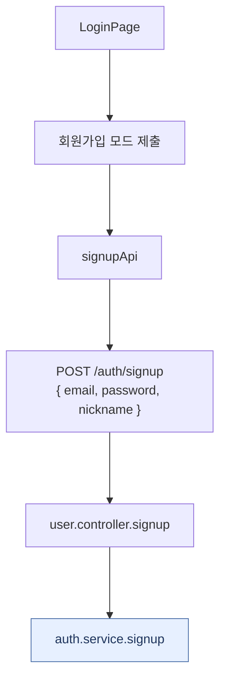
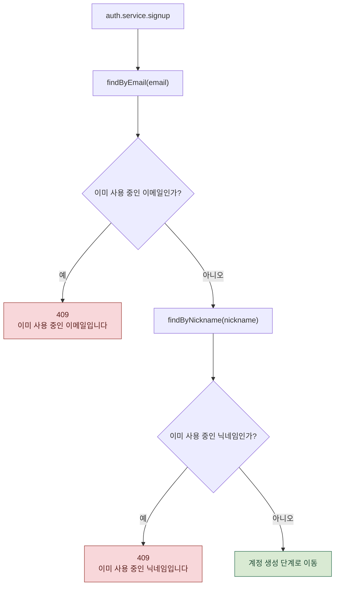
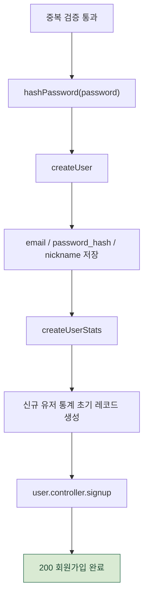
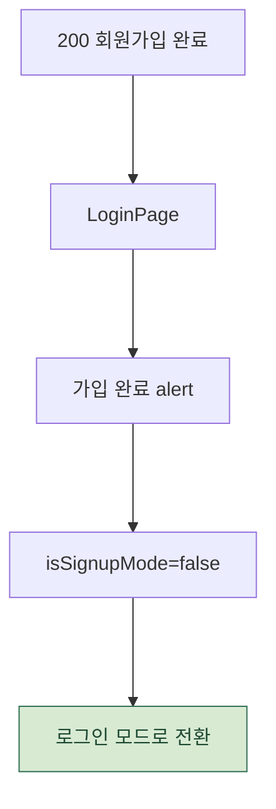

# 회원가입 요청 처리 흐름

`POST /auth/signup` 요청이 `LoginPage.jsx` -> `auth.js` -> `user.controller.js` -> `auth.service.js` -> `user.repositories.js`를 거치는 실제 코드 흐름입니다.

회원가입은 프론트 제출, 중복 검증, 생성 후 화면 전환으로 나누어 크게 볼 수 있게 했습니다.

관련 파일:

- `frontend/src/domains/auth/pages/LoginPage.jsx`
- `frontend/src/domains/auth/api/auth.js`
- `backend/controller/user.controller.js`
- `backend/service/auth.service.js`
- `backend/repositories/user.repositories.js`

---

## 1. 프론트 제출과 API 호출

프론트는 회원가입 모드일 때 `signupApi(formData)`를 호출합니다.

---

## 2. 이메일과 닉네임 중복 검증

이메일 중복을 먼저 검사하고, 통과하면 닉네임 중복을 검사합니다.

---

## 3. 유저와 통계 생성

유저 생성 직후 `UserStats` 초기 레코드를 만들어 마이페이지 통계 조회가 null 없이 동작하게 합니다.

---

## 4. 가입 완료 후 프론트 처리

회원가입 성공 후 자동 로그인하지 않습니다.
사용자는 가입 완료 안내 후 로그인 모드에서 다시 로그인합니다.

---

## 실제 코드에서 주의할 점 3가지

1. **회원가입 성공 후 자동 로그인하지 않습니다.** 프론트는 가입 완료 안내 후 `isSignupMode`를 끄고 로그인 모드로 돌아갑니다.
2. **이메일 중복을 먼저 검사하고 닉네임 중복을 나중에 검사합니다.** 둘 다 409로 처리됩니다.
3. **유저 생성 직후 `UserStats` 초기 레코드를 생성합니다.** 마이페이지 통계 조회가 null 없이 동작하게 만드는 흐름입니다.

---

## 단계별 코드 위치

| 단계 | 파일:라인 | 내용 |
| --- | --- | --- |
| 제출 분기 | `LoginPage.jsx:57-78` | 회원가입 모드면 `signupApi(formData)` 호출 |
| API 함수 | `auth.js:18-20` | `POST /auth/signup` |
| 컨트롤러 | `user.controller.js:15-22` | `authService.signup` 호출 후 200 응답 |
| 이메일 중복 | `auth.service.js:22-25` | `findByEmail`, 있으면 409 |
| 닉네임 중복 | `auth.service.js:27-30` | `findByNickname`, 있으면 409 |
| 비밀번호 해싱 | `auth.service.js:32` | `hashPassword(password)` |
| 유저/통계 생성 | `auth.service.js:33-35` | `createUser`, `createUserStats` |
