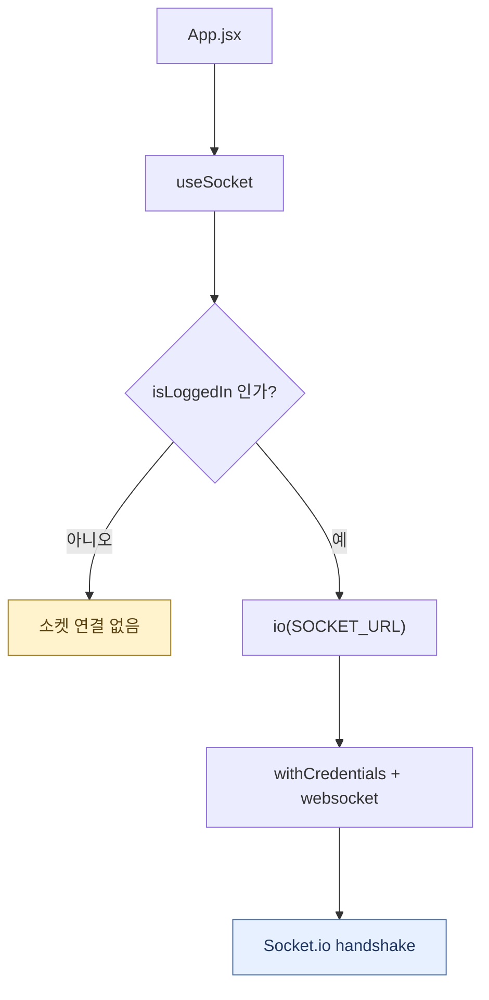
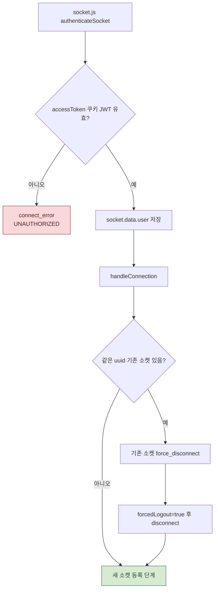
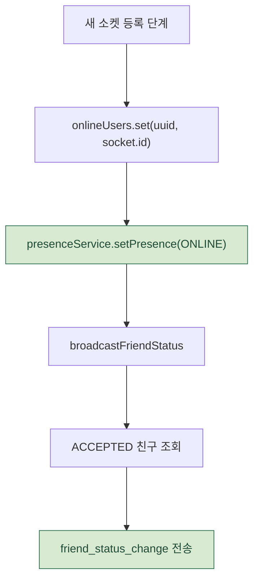
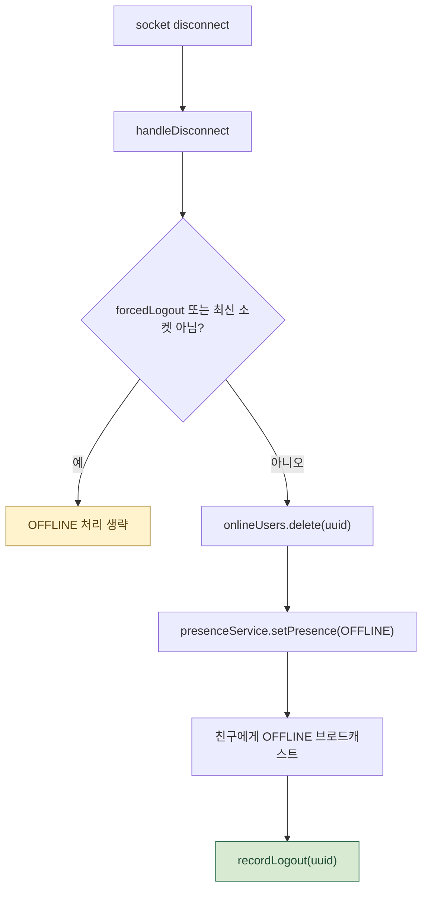
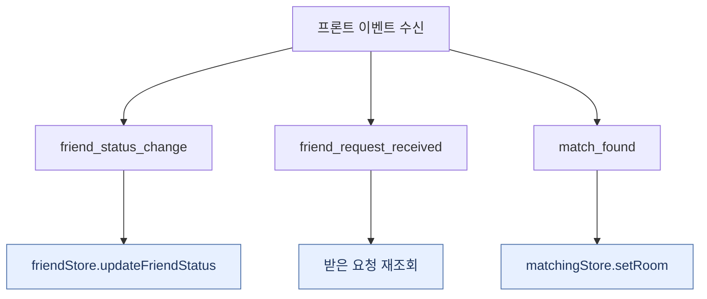

# 소켓 / 접속 상태 처리 흐름

로그인 상태에 따라 프론트가 Socket.io 연결을 맺고, 백엔드는 쿠키 JWT 인증, 단일 접속 제어, 친구 접속 상태 브로드캐스트를 처리합니다.

연결, 인증, 강제 종료, disconnect, 프론트 이벤트 수신을 각각 나누어 크게 보이도록 구성했습니다.

관련 파일:

- `frontend/src/app/App.jsx`
- `frontend/src/shared/hooks/useSocket.js`
- `frontend/src/shared/socket/socketClient.js`
- `frontend/src/domains/lobby/store/friendStore.js`
- `backend/socket/socket.js`
- `backend/service/presence.service.js`
- `backend/repositories/friend.repositories.js`
- `backend/repositories/user.repositories.js`

---

## 1. 프론트 소켓 연결 시작

프론트는 로그인 상태일 때만 소켓을 연결하고, 쿠키를 함께 보내기 위해 `withCredentials`를 사용합니다.

---

## 2. 소켓 인증과 단일 접속 제어

동일 유저는 소켓 하나만 유지합니다.
새 소켓이 연결되면 기존 소켓에 `force_disconnect`를 보내고 끊습니다.

---

## 3. ONLINE 반영과 친구 상태 브로드캐스트

접속 상태 변경은 친구 관계가 `ACCEPTED`인 사용자들에게만 브로드캐스트됩니다.

---

## 4. disconnect와 OFFLINE 처리

강제 종료된 구 소켓은 OFFLINE을 덮어쓰지 못합니다.
`forcedLogout` 플래그와 `onlineUsers` 맵 비교로 레이스를 막습니다.

---

## 5. 프론트 이벤트 수신

`emitToUser`는 현재 온라인인 유저에게만 보냅니다.
오프라인이면 이벤트를 저장하지 않고 무시합니다.

---

## 실제 코드에서 주의할 점 3가지

1. **동일 유저는 소켓 하나만 유지합니다.** 새 소켓이 연결되면 기존 소켓에 `force_disconnect`를 보내고 끊습니다.
2. **강제 종료된 구 소켓은 OFFLINE을 덮어쓰지 못합니다.** `forcedLogout` 플래그와 `onlineUsers` 맵 비교로 레이스를 막습니다.
3. **`emitToUser`는 현재 온라인인 유저에게만 보냅니다.** 오프라인이면 이벤트를 저장하지 않고 무시합니다.

---

## 단계별 코드 위치

| 단계 | 파일:라인 | 내용 |
| --- | --- | --- |
| 소켓 훅 실행 | `App.jsx` | 앱 최상단에서 `useSocket()` 호출 |
| 소켓 연결 | `useSocket.js:24-93` | 로그인 상태에 따라 연결/이벤트 구독/cleanup |
| 소켓 공유 | `socketClient.js` | 다른 훅에서 emit할 수 있도록 싱글턴 저장 |
| 인증 | `socket.js:86-97` | 핸드셰이크 쿠키 JWT 검증 |
| 연결 처리 | `socket.js:106-125` | 단일 접속 제어, ONLINE 반영 |
| 해제 처리 | `socket.js:136-144` | OFFLINE 반영, 로그아웃 기록 |
| 브로드캐스트 | `socket.js:152-161` | ACCEPTED 친구에게 상태 전파 |
