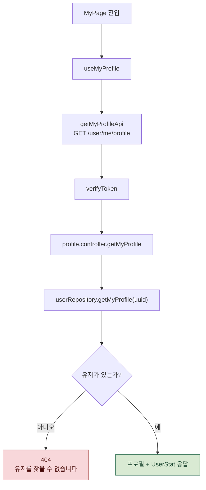
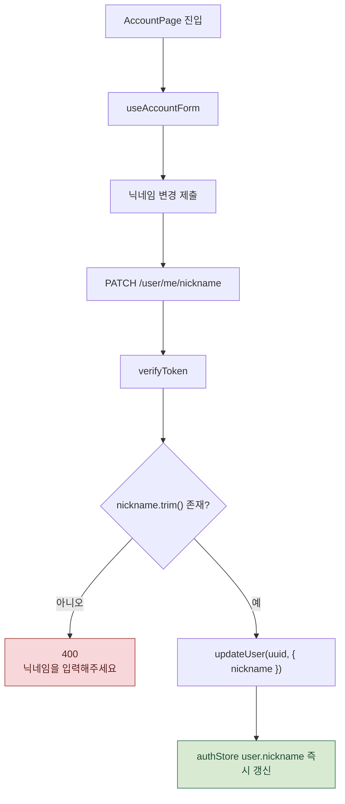
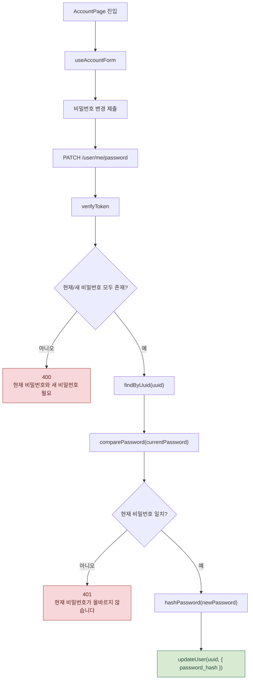

# 사용자 / 계정 처리 흐름

마이페이지 프로필 조회와 계정 페이지의 닉네임/비밀번호 변경 흐름입니다.

프로필 조회, 닉네임 변경, 비밀번호 변경은 서로 독립적인 요청이므로 각각 분리해 크게 볼 수 있게 했습니다.

관련 파일:

- `frontend/src/domains/user/pages/MyPage.jsx`
- `frontend/src/domains/user/hooks/useMyProfile.js`
- `frontend/src/domains/user/pages/AccountPage.jsx`
- `frontend/src/domains/user/hooks/useAccountForm.js`
- `frontend/src/domains/user/api/user.js`
- `backend/routes/user.routes.js`
- `backend/controller/profile.controller.js`
- `backend/repositories/user.repositories.js`

---

## 1. 마이페이지 프로필 조회

프로필 조회는 `UserStat`이 없어도 기본값을 채워 화면이 null에 기대지 않도록 합니다.

---

## 2. 닉네임 변경

닉네임 변경 후에는 서버 재조회 없이 프론트 store도 즉시 갱신합니다.

---

## 3. 비밀번호 변경

비밀번호 변경은 현재 비밀번호 검증 후 진행됩니다.
실패 시 새 비밀번호 해싱은 실행하지 않습니다.

---

## 실제 코드에서 주의할 점 3가지

1. **프로필 조회는 `UserStat`이 없어도 기본값을 채웁니다.** 평판/전적/칭호가 null이면 0 또는 `신참`으로 응답합니다.
2. **닉네임 변경 후 프론트 store도 즉시 갱신합니다.** 서버 재조회 없이 배너 등에 새 닉네임이 반영됩니다.
3. **비밀번호 변경은 현재 비밀번호 검증 후 진행됩니다.** 실패 시 401로 종료하고 새 비밀번호 해싱은 실행하지 않습니다.

---

## 단계별 코드 위치

| 단계 | 파일:라인 | 내용 |
| --- | --- | --- |
| 프로필 훅 | `useMyProfile.js:13-47` | 마운트 시 `getMyProfileApi` 호출, 화면용 데이터로 변환 |
| 계정 폼 훅 | `useAccountForm.js:11-67` | 닉네임/비밀번호 폼 상태와 API 처리 |
| 프론트 API | `user.js:10-20` | `/user/me/profile`, `/nickname`, `/password` |
| 라우트 | `user.routes.js` | 세 엔드포인트 모두 `verifyToken` 적용 |
| 프로필 조회 | `profile.controller.js:12-36` | 프로필/통계 응답 |
| 닉네임 변경 | `profile.controller.js:42-53` | 빈 값 검증 후 업데이트 |
| 비밀번호 변경 | `profile.controller.js:59-82` | 현재 비밀번호 검증, 새 비밀번호 해싱 |
